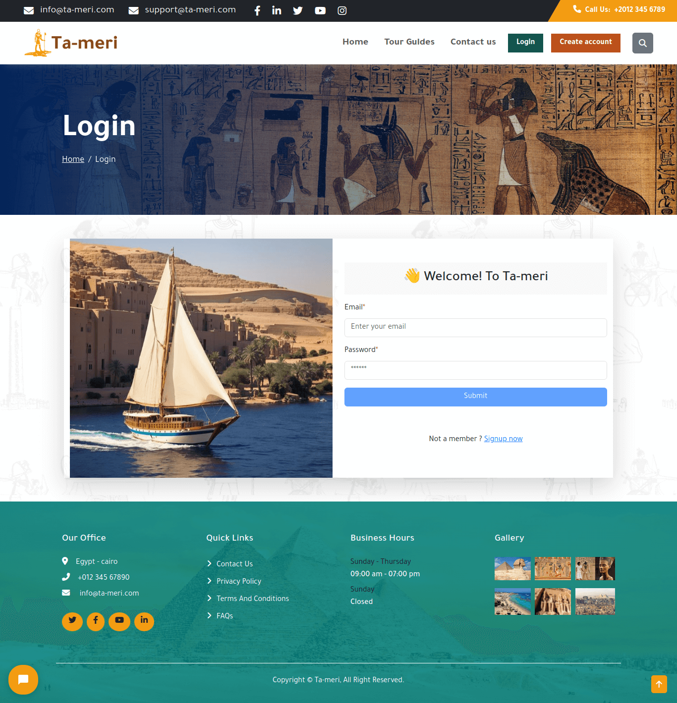
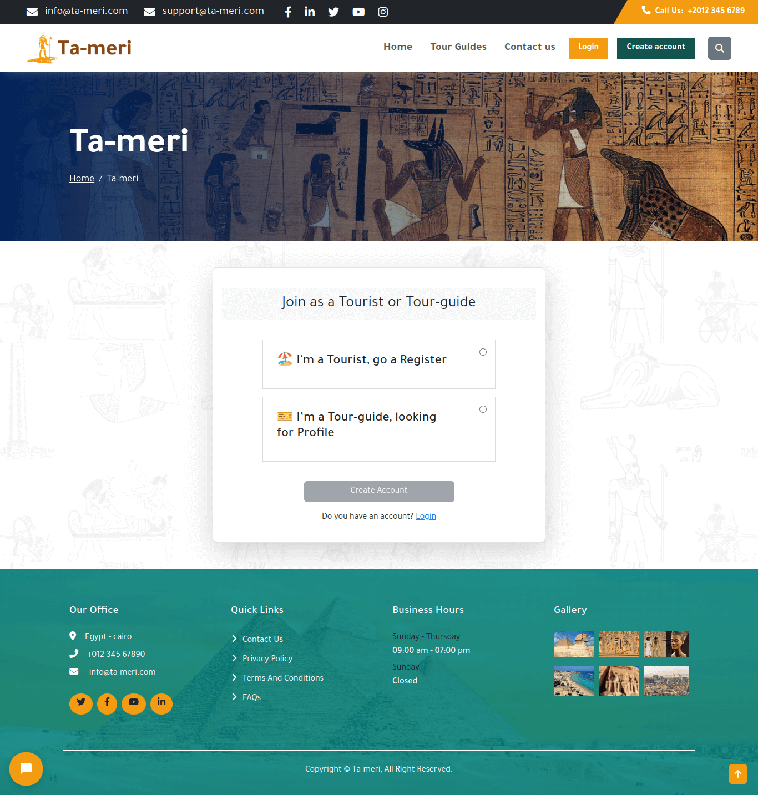
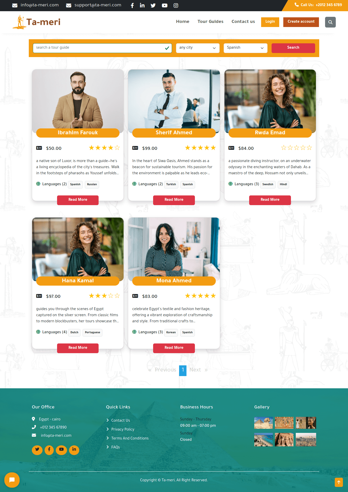

# Tameri Frontend Project

## Project Description
Welcome to the Tameri Frontend Project, an Angular-based platform aiming to revolutionize the tourist experience in Egypt by connecting tourists with qualified tour guides. Our platform is designed to address common challenges faced by tourists, such as language barriers, lack of knowledge about tourist places, and difficulties in scheduling flights.

## Team Members
- [Ahmed Shaaban Ahmed](https://github.com/ahmedshaaban1608)
- [Dina Emad Noureldin](https://github.com/dinaemad88)
- [Rawan Ramadan Ismail](https://github.com/rawanramadan22)
- [Rwda Emad eldeen](https://github.com/rwda)
- [Hamza Mahmoud Omar](https://github.com/hamza-halawa2020)


## Backend (Laravel)
The backend is implemented using the Laravel framework, providing a robust foundation for server-side functionality.
- [Tameri Backend Repo](https://github.com/ahmedshaaban1608/tameri-backend)

##

## Clients
Our platform caters to two main client groups:
1. **Foreign Tourists**: Individuals from around the world seeking a unique and personalized tourism experience in Egypt.
2. **Local Tourists**: Residents looking for exciting local tourism experiences within Egypt.

## Functionality
1. **User Registration and Login**: Secure and easy-to-use authentication for both tourists and tour guides.
2. **Tour Guide Search**: A robust search functionality to find qualified tour guides based on various criteria.
3. **Booking System**: Streamlined booking process for tourists to plan their itinerary.
4. **Reviews and Ratings**: A system for users to leave reviews and ratings for tour guides, enhancing transparency.
5. **Responsive Design**: Ensuring an optimal user experience across devices and screen sizes.
6. **Payment Gateway**: Secure and convenient online payment processing for bookings.
7. **Information Security**: Implementing measures to safeguard user data and privacy.
8. **Scalability**: A scalable architecture to accommodate future growth and features.
9. **High Performance**: Optimized performance for a seamless user experience.
10. **Usability**: Intuitive design and user interface to enhance usability.
11. **Search Engine Optimization (SEO)**: Implementation of best practices to improve visibility on search engines.

## Website Structure
1. **User Registration and Login**
2. **Home Page**
3. **Contact Us**
4. **Search for Tour Guide**
5. **Profile Pages** (Tour Guide, Tourist)
6. **Tourist Dashboard** (Reviews, Ratings, Bookings)
7. **Responsive Design**
8. **Services**
9. **Components** (Tour Guide, Tourist, Login, Register, About, Contact, Feedback, Profile, Not Found, Review, Search, Navbar, Footer)

## Technologies Used
- HTML
- CSS
- JavaScript
- Font Awesome
- Bootstrap
- TypeScript
- Angular Framework
- CircleCI
- Tidio (Chatbot)
- Git & GitHub


## Getting Started
To run the project locally, follow these steps:

### Prerequisites
- Node.js and npm installed on your machine.

### Clone the Repository
```bash
git clone https://github.com/ahmedshaaban1608/Ta-meri.git
```

### Clone the Repository
```bash
cd tameri-frontend
```
### Install Dependencies
```bash
npm install
```
### Run the Development Server
```bash
ng serve -o
```
### Access the Application
Open your web browser and navigate to http://localhost:4200/


##
## Project gallery
- Homepage


- Tourguides list


- Contact us


- Login


- Create Account


- Tourist register


- Tourguide register


- Search


- Tourguide Profile


- Tourguide update


- Tourguide orders


##
Feel free to explore our project and contribute to making Egypt's tourism experiences memorable for everyone!